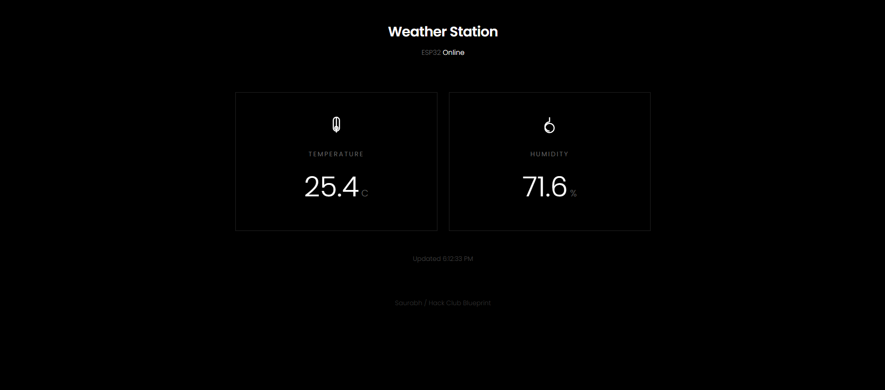
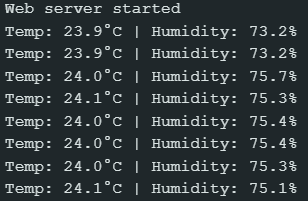
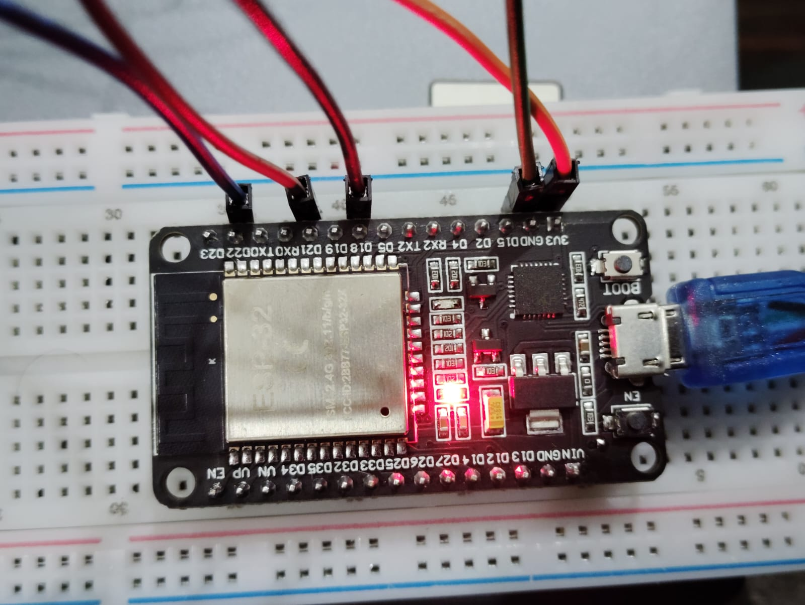

# ESP32 Weather Station

A weather station that reads temperature and humidity using a DHT11 sensor and displays the data on a 0.96 inch OLED display and hosts a minimal web dashboard accessible from any device on your network


## Overview

This project takes an ESP32 a and makes a WiFi-connected weather monitor It reads temperature and humidity from a DHT11 sensor every 2 seconds and shows the data on an OLED display along with the devices IP address and runs a web server that hosts a clean minimal dashboard Just open the IP on your phone or laptop and you get live updating weather data.

## Why I Made This

I wanted to build something practical that uses sensors displays and networking all in one project Originally i planned to add a PIR motion sensor to prevent screen burn but that sensor came with broken pins and no labels so I scrapped it lol T_T The OLED barely uses power anyway so it's fine running continuously



## Hardware Components

- ESP32 Development Board
- DHT11 Temperature & Humidity Sensor
- 0.96 inch OLED Display (128x64, I2C, SSD1306)
- Breadboard
- Jumper Wires

## Pin Connections

### DHT11 Sensor
```
VCC  -> 3.3V
DATA -> GPIO 18
GND  -> GND
```

### OLED Display (I2C)
```
VCC -> 3.3V
GND -> GND
SDA -> GPIO 21
SCL -> GPIO 22
```



## Required Libraries

Install these through Arduino IDE Library Manager:

1. **Wire** (Built-in)
2. **Adafruit GFX Library** by Adafruit
3. **Adafruit SSD1306** by Adafruit
4. **DHT sensor library** by Adafruit
5. **Adafruit Unified Sensor** by Adafruit

### Installation

1. Open Arduino IDE
2. Go to Sketch -> Include Library -> Manage Libraries
3. Search and install each library listed above
4. Restart Arduino IDE

## How to Upload

1. Install ESP32 board support in Arduino IDE:
   - Go to File -> Preferences
   - Add `https://dl.espressif.com/dl/package_esp32_index.json` to Additional Board Manager URLs
   - Go to Tools -> Board -> Boards Manager
   - Search for "ESP32" and install "ESP32 by Espressif Systems"

2. Connect your ESP32 via USB

3. Open `Firmware/main.ino`

4. **Update WiFi credentials** at the top of the file:
   ```cpp
   const char* ssid = "yourwifiname/ssid";
   const char* password = "yourwifipassword";
   ```

5. Select board and port:
   - Tools -> Board -> ESP32 Arduino -> ESP32 Dev Module
   - Tools -> Port -> (Select your COM port)

6. Click Upload (->)

7. Open Serial Monitor (115200 baud) to see the IP address

8. Open that IP in any browser on your network

## Features

- Real-time temperature and humidity monitoring
- OLED display showing sensor data and IP address
- Minimal black & white web dashboard
- Auto refreshing data every 3 seconds
- Mobile responsive design
- JSON API endpoint at `/data`



## How It Works

The ESP32 connects to your WiFi and starts a web server with two endpoints:
- `/` serves the HTML dashboard
- `/data` returns JSON with current readings

## Dashboard

Went with a super minimal look black background white text Poppins font just clean boxes with inline SVG icons (fontawesome cdn wasnt working so had to use inline svgs).

## Common Issues

**OLED not working:**
- Check I2C connections (SDA -> GPIO 21, SCL -> GPIO 22)
- Verify display address is 0x3C (some use 0x3D)
- Make sure VCC is on 3.3V not 5V

**WiFi not connecting:**
- Double check SSID and password (case sensitive)
- Make sure its a 2.4GHz network (ESP32 doesnt support 5GHz)
- Check Serial Monitor for connection status

**DHT11 read failed:**
- Verify DATA pin is on GPIO 18
- Check VCC is connected to 3.3V
- Try a different GPIO pin

**IP showing 0.0.0.0:**
- WiFi credentials are wrong
- Router might be blocking the device
- Try a mobile hotspot to test

## Bill of Materials

| Item | Description | Qty | Price ($) |
|------|-------------|-----|-----------|
| ESP32 Dev Board | ESP32 microcontroller | 1 | 3.99 |
| 0.96" OLED Display | 128x64 I2C Display | 1 | 1.99 |
| DHT11 Sensor | Temp & Humidity Sensor | 1 | 0.60 | 
| Breadboard | 400 point breadboard | 1 | 0.60 | 
| Jumper Wires M-F | Male-to-Female pack | 1 | 0.20 |
| Jumper Wires M-M | Male-to-Male pack | 1 | 0.20 | 
| **TOTAL** | | | **$7.58** | |

## Project Structure

```
ESP32-Weather-Station/
├── Firmware/     # test files and main code
│   └── main.ino  # main file
├── assets/       # Images
├── BOM.csv       # Bill of materials
└── README.md     # you're reading this rn lol
```

## Acknowledgements

Built this for [Hack Club Blueprint](https://blueprint.hackclub.com/) learned a ton about ESP32 web servers, I2C displays, and serving HTML from microcontrollers 

Blueprint Project Link - [Link](https://blueprint.hackclub.com/projects/1195)

Demo video Link (Drive) - [Link](https://drive.google.com/file/d/187TIFS0cHQxdLSPZ7vN6z27YRnyrfwqx/view?usp=sharing)

---

## You may also like...

- [Sorta](https://github.com/Rexaintreal/Sorta) - A web app to visualize sorting algorithms
- [Ziks](https://github.com/Rexaintreal/Ziks) - A physics simulator with 21 Simulatons made using vanilla JS
- [Eureka](https://github.com/Rexaintreal/Eureka) - A website where you can find local spots near you which don't show up on Maps
- [DawnDuck](https://github.com/Rexaintreal/DawnDuck) - USB HID Automation Tool for Morning Routines
- [Lynx](https://github.com/Rexaintreal/lynx) - OpenCV Image Manipulation WebApp
- [Libro Voice](https://github.com/Rexaintreal/Libro-Voice) - PDF to Audio Converter
- [Snippet Vision](https://github.com/Rexaintreal/Snippet-Vision) - YouTube Video Summarizer
- [Weather App](https://github.com/Rexaintreal/WeatherApp) - Python Weather Forecast App
- [Python Screenrecorder](https://github.com/Rexaintreal/PythonScreenrecorder) - Python Screen Recorder
- [Typing Speed Tester](https://github.com/Rexaintreal/TypingSpeedTester) - Python Typing Speed Tester
- [Movie Recommender](https://github.com/Rexaintreal/Movie-Recommender) - Python Movie Recommender
- [Password Generator](https://github.com/Rexaintreal/Password-Generator) - Python Password Generator
- [Object Tales](https://github.com/Rexaintreal/Object-Tales) - Python Image to Story Generator
- [Finance Manager](https://github.com/Rexaintreal/Finance-Manager) - Flask WebApp to Monitor Savings
- [Codegram](https://github.com/Rexaintreal/Codegram) - Social Media for Coders
- [Simple Flask Notes](https://github.com/Rexaintreal/Simple-Flask-Notes) - Flask Notes App
- [Key5](https://github.com/Rexaintreal/key5) - Python Keylogger
- [Codegram2024](https://github.com/Rexaintreal/Codegram2024) - Modern Codegram Update
- [Cupid](https://github.com/Rexaintreal/cupid) - Dating Web App for Teenagers
- [Gym Vogue](https://github.com/Rexaintreal/GymVogue/) - Ecommerce for Gym Freaks
- [Confessions](https://github.com/Rexaintreal/Confessions) - Anonymous Confession Platform
- [Syna](https://github.com/Rexaintreal/syna) - Social Music App with Spotify
- [Apollo](https://github.com/Rexaintreal/Apollo) - Minimal Music Player with Dancing Cat
- [Eros](https://github.com/Rexaintreal/Eros) - Face Symmetry Analyzer
- [Notez](https://github.com/Rexaintreal/Notez) - Clean Android Notes App


---

## Author

Built by **Saurabh Tiwari**

- Email: [saurabhtiwari7986@gmail.com](mailto:saurabhtiwari7986@gmail.com)
- Twitter: [@Saurabhcodes01](https://x.com/Saurabhcodes01)
- Instagram: [@saurabhcodesawfully](https://instagram.com/saurabhcodesawfully)
